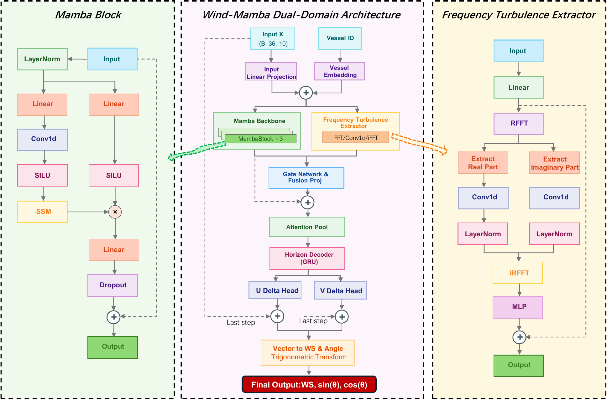

# Wind-Mamba


Wind-Mamba is a compact research implementation for short-term marine wind forecasting on unmanned sailboats. The model combines persistence-guided residual wind-vector prediction, a Mamba-based temporal state-space branch, Fourier spectral fluctuation extraction, and dual-domain fusion.

## 📌 News | Project Progress

- 🧭 **2026-06-17:** Added public chronological interval-calibration script (`interval.py`).
- 🌊 **2026-05-31:** Added Wind-Mamba architecture schematic to the repository.
- 🔧 **2026-05-29:** Released the core model, dataset loader, training entry point, and experiment configuration.

## 🧠 Architecture



## ✨ Highlights

- ⚓ **Persistence-guided residual forecasting:** predicts wind-vector increments relative to the latest onboard observation.
- 🌀 **Temporal-spectral dual-domain modeling:** combines Mamba temporal state evolution with Fourier-domain fluctuation extraction.
- 🧪 **Chronological split protocol:** uses chronological train/validation/test slices with training-only normalization.
- 📈 **Post-hoc interval calibration:** evaluates horizon-wise wind-speed prediction intervals with PICP, MPIW, and Winkler score.

## 📁 Repository Structure

```text
Wind-mamba/
  model.py              # Wind-Mamba model, loss functions, and Mamba backend support
  main.py               # Training and evaluation entry point
  interval.py           # Chronological wind-speed interval calibration
  data_provider.py      # Chronological split, normalization, and sliding windows
  experiment_config.py  # Vessel configuration and source/target split
  requirements.txt      # Python dependencies used in the reported experiments
  assets/               # Public schematic figures
```

## 🌊 Data

This repository does **not** include raw or processed Saildrone data. Raw Saildrone mission files are publicly available from the NOAA PMEL Saildrone archive and ERDDAP/NetCDF access service:

<https://data.pmel.noaa.gov/pmel/erddap/info/index.html?page=1&itemsPerPage=1000>

After downloading and preprocessing the mission files, place the processed CSV files under `processed_data/` by default:

```text
processed_data/
  processed_sd1031.csv
  processed_sd1033.csv
  processed_sd1036.csv
  ...
  processed_sd1091.csv
```

If your processed files are stored elsewhere, set the data root before running:

```bash
export WIND_MAMBA_DATA_ROOT=/path/to/your/processed_data
```

Windows PowerShell:

```powershell
$env:WIND_MAMBA_DATA_ROOT="D:\path\to\your\processed_data"
```

Each processed CSV should follow the schema used in `data_provider.py`, including:

- `time`
- `latitude`, `longitude`
- `SOG`, `COG`, `HDG`
- `UWND_MEAN`, `VWND_MEAN`, `GUST_WND_MEAN`
- `TEMP_AIR_MEAN`, `BARO_PRES_MEAN`
- `WS_TRUE`, `WD_TRUE`

## ⚙️ Installation

```bash
pip install -r requirements.txt
```

The official `mamba-ssm` package is optional. If unavailable, `model.py` falls back to a custom PyTorch implementation.

## 🚀 Training

```bash
python main.py
```

Common settings can be controlled with environment variables:

```bash
WIND_MAMBA_SEQ_LEN=36
WIND_MAMBA_PRED_LEN=6
WIND_MAMBA_SEED=42
WIND_MAMBA_LOSS_MODE=smoothl1_dircos
WIND_MAMBA_WD_WEIGHT=1.0
WIND_MAMBA_UPPER_TAIL_WS_THRESHOLD=10.59
```

Outputs are written to `weights/` and `figures/`, both of which are ignored by Git.

## 📊 Interval Calibration

After training transfer checkpoints with `main.py`, run:

```bash
python interval.py
```

This script performs post-hoc chronological interval calibration for wind-speed forecasts. It uses validation-calibration residuals to construct pointwise, horizon-wise prediction intervals and evaluates:

- `PICP`: prediction interval coverage probability
- `MPIW`: mean prediction interval width
- `Winkler score`: interval sharpness and miss penalty

By default, the script uses the manuscript setting:

```bash
python interval.py \
  --seq-len 36 \
  --pred-len 6 \
  --upper-tail-ws-threshold 10.59
```

Outputs are written to:

```text
interval_outputs/transfer_two_targets_v1/
  interval_metrics_summary.csv
  interval_metrics_stratified.csv
  interval_margin_sensitivity.csv
  interval_config.json
```

Notes:

- The interval module calibrates **wind speed only**, not wind direction.
- The intervals are **pointwise and horizon-wise**, not joint trajectory intervals.
- The validation-selected margin is an empirical operating-margin factor for non-stationary marine wind measurements.
- Visualization-case exports are for plotting only and are not used for calibration, model selection, or quantitative evaluation.

## 🧩 Customization

Useful command-line options:

```bash
python interval.py --help
```

Examples:

```bash
python interval.py --checkpoint-root weights/transfer_two_targets_v1/wind_mamba
python interval.py --output-root interval_outputs/custom_run
python interval.py --no-export-cases
```

## ⚠️ Reproducibility Notes

- Raw data, processed data, trained weights, and the full manuscript figure set are not included.
- The user must prepare processed CSV files following the schema above.
- The public code is intended to clarify the model and evaluation pipeline; exact paper-number reproduction requires the same processed data, chronological splits, and trained checkpoints.

